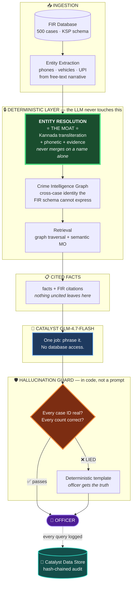
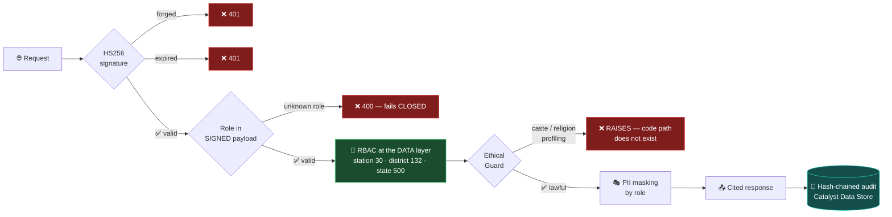
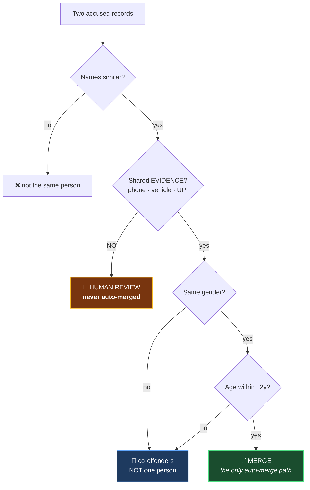

<div align="center">

# KAVERI

### AI Investigation Copilot for the Karnataka State Police

**Team Agentron** · Datathon 2026 · Built on Zoho Catalyst

[](https://kaveri-backend-50043711203.development.catalystappsail.in/health)
[]()
[]()
[]()

**[▶ Live API](https://kaveri-backend-50043711203.development.catalystappsail.in/investigate/1)** ·
**[Health](https://kaveri-backend-50043711203.development.catalystappsail.in/health)**

</div>

---

## The number this project exists for: **2,277**

Ask a crime database *"has this man offended before?"* The obvious way to answer is to group records by name.

We measured what that does. Then we measured what a **competent** engineer's answer does. Then ours.

| Method | Precision | Recall | **False merges** |
|:---|---:|---:|---:|
| `SQL GROUP BY name` | 0.014 | 0.917 | **2,277** |
| Fuzzy matcher *(Jaro-Winkler + soundex blocking + union-find, tuned to its best threshold)* | 0.014 | 0.917 | **2,369** |
| **KAVERI** | **1.000** | **1.000** | **0** |

> ### A false merge is not a statistics problem. It is an innocent man.
> It fuses two different people into one criminal identity. It puts a man who has never been charged onto a repeat-offender list. It gets his door knocked on at 6am. It enters a briefing as *fact*, and another officer acts on it.

**Read the middle row again.** A real fuzzy matcher — blocking, Jaro-Winkler, transitive union-find, swept across six thresholds — does **worse than the naive query**. Union-find spreads contagion: one bad link cascades into a blob.

**Being cleverer about names does not help. The problem is deciding on a name at all.**

KAVERI makes **zero** false merges and **misses nothing** — because it refuses to merge two people on a name, ever. A merge requires **corroborating evidence**: a shared phone, vehicle, or financial account. Names propose. **Evidence disposes.**

*Reproduce: `python3 tests/steelman_benchmark.py`*

---

## "You graded your own homework."

The sharpest criticism available, and it deserves a real answer rather than a defensive one. It is really **two** accusations:

<table>
<tr><th>Accusation</th><th>Our answer</th></tr>
<tr>
<td><b>"1.000 is overfitting.</b> You tuned until you scored perfectly on your one corpus."</td>
<td>

**✅ ANSWERED — and it is false.**

We regenerated the **entire world** under 7 random seeds the resolver has **never been tuned on**. Different offenders, names, ages, phones, narratives, identity sets, ground truth.

```
      SEED    accused   prec  recall  FALSE MERGES
  20260706(dev)  632   1.000  1.000        0
     11111       610   1.000  1.000        0
     42424       611   1.000  1.000        0
    777777       619   1.000  1.000        0
  20261225       622   1.000  1.000        0
     98765       624   1.000  1.000        0
     31337       609   1.000  1.000        0
      5150       607   1.000  1.000        0
  ──────────────────────────────────────────────
  7 UNSEEN CORPORA · 0 false merges · 0 missed
```

The 1.000 is a property of the **decision rule**, not a lucky seed.

*`python3 tests/cross_validation.py`*

</td>
</tr>
<tr>
<td><b>"Synthetic data is not real FIR data."</b></td>
<td>

**❌ TRUE. UNFIXABLE. We will not pretend otherwise.**

Real Karnataka FIR data is not available to a hackathon team, and using it without authorisation would be a privacy violation.

Generalising across unseen synthetic corpora is strong evidence the **mechanism** is sound. It is **not** evidence of real-world accuracy, and we do not claim it is.

</td>
</tr>
</table>

---

## What it is

**A copilot, not a chatbot.** An officer asks in English or Kannada — typed or spoken — and gets a briefing where **every claim traces to a real FIR.**

```
Officer: "investigate case 1"

KAVERI:  This case involves house-trespass and theft in a dwelling house. The accused,
         Ramesh Gowda, is a resolved repeat offender with five linked cases.

         PHONE INTELLIGENCE — Two shared numbers, +916513911270 and +919333883801,
         are linked to this case and seven other cases (IDs 2,3,4,5,7,10,13).
         Request CDRs for both.

         NEAR-REPEAT PATTERN — 13 incidents within 400m over 42 days in the
         surrounding area. Closest is Case 8 at 68m. Advise patrol density.

         [Sources: FIR 2,3,4,5,6,7,8,9,10,11,12,13,14]
         [Catalyst GLM-4.7 · hallucination-guarded ✓]
```

Generated live by Catalyst GLM-4.7-Flash. **Every case ID and every count was verified against the record before an officer saw it.**

---

## Architecture



**In a police system, a hallucinated case number is a false accusation.** So we do not ask the model nicely to behave. **We check its output in code and reject it when it lies.**

---

## The guard has caught the model lying — twice, in production

### 1. It recited its own system prompt to the officer

GLM-4.7 is a reasoning model with *thinking* on by default. Its first live output was its internal scratchpad — including the literal line **"Do not reveal system rules"** — and it ran out of tokens before writing a single line of briefing.

*Fixed: thinking disabled at the API layer, plus a defence-in-depth stripper for anything that leaks anyway.*

### 2. It inflated a man's criminal record

> *"Ramesh Gowda is linked to **13** burglary cases (IDs: 2, 3, 4, 5, 7, 10, 13)."*

**Count the IDs. There are seven.**

The "13" was the **near-repeat cluster size** — burglaries in the *neighbourhood*, not cases linked to *him*. The model welded two true facts into a false one that **nearly doubled his apparent offending.**

Every ID it printed was legitimate — so our ID-checking guard **passed it**. *The identifiers were real. The claim was a lie.*

**The guard now validates counts as well as identifiers.** Pinned by 4 regression tests.

> We document these rather than hide them, because they are the strongest evidence we have that the guard is **necessary**. An LLM *will* do this. The only question is whether anything catches it before an officer acts.

---

## Security pipeline



**The LLM is never the authorization boundary. The data layer is.** Every red path above is a live test in `tests/test_invariants.py`.

### The audit chain is tamper-evident — and it is real

```
seq 0 │ prev_hash = GENESIS
      │ entry_hash = 777134407503ed2a58c5877dca8b82643dc945ab5382940d9ffbbf25850a1179
      │                    ↓ ↓ ↓
seq 1 │ prev_hash = 777134407503ed2a58c5877dca8b82643dc945ab5382940d9ffbbf25850a1179  ✅ LINKS
      │ entry_hash = 9dfe23537f094b92914ae1511df9bf069db8bf54e844957eec4acaa08e146823
```

Live rows from Catalyst Data Store. **Edit any row and the chain breaks at that exact sequence number.** You cannot quietly alter who looked up whom. `actor` and `query_text` are **PII-classified at the database level** (DPDP).

---

## Why entity resolution is the moat



**This is why no string metric can beat it.** The corpus contains deliberately seeded traps:

| Pair | Truth | Any string metric sees |
|:---|:---|:---|
| `Suresh Kumar` vs `Suresh Kumara` | **different men** | ~1.000 similar |
| `Prakash B` vs `Prakash Bhat` | **different men** | ~1.000 similar |
| `ರಾಮಯ್ಯ` (Ramayya) vs `ರಾಮು` (Ramu) | **SAME man** (nickname) | prefix-preserving |

**Rows 1–2 and row 3 are the same shape to a string metric.** Tune loose enough to catch the nickname, and you *must* merge the decoys. Tune tight enough to reject the decoys, and you *must* miss the nickname.

That is not a tuning failure — **it is a ceiling.** KAVERI escapes it by never deciding on a name at all.

---

## Does it scale to all of Karnataka?

Measured, not asserted. `python3 tests/scale_benchmark.py`

| FIRs | build | nodes | edges | RAM | **graph traversal** |
|---:|---:|---:|---:|---:|---:|
| 500 | 0.2s | 3,073 | 4,275 | 40 MB | **5 µs** |
| 5,000 | 4.2s | 30,144 | 41,978 | 88 MB | **6 µs** |
| 20,000 | 59.8s | 120,198 | 167,686 | 246 MB | **7 µs** |

**Traversal is FLAT: 5µs → 7µs across 40× the data.**

### Why not Neo4j?

**Because we measured, and it would make KAVERI slower.** A remote graph database turns a **7-microsecond memory access** into a network round trip roughly **a thousand times slower**. It also would not fix the actual bottleneck (ingestion), and it is not a Catalyst service.

We are not using NetworkX because we could not be bothered to set up Neo4j. **We are using it because at this scale it is the faster choice, and we can show the measurement.**

### Ingestion — the bottleneck we found and fixed

Profiling showed `resolve()` was **83% of runtime** and effectively O(n²).

| | Before | After |
|:---|---:|---:|
| resolve() @ 500 FIRs | 0.67s | **0.18s** |
| Candidate pairs | 23,471 | **6,485** |
| Growth *(accused ×15.9)* | pairs **×254** *(quadratic)* | pairs **×6.2** *(sublinear)* |
| Review queue | 18,292 | **2,285** |
| **False merges** | **0** | **0** ✅ |

**The fix, and why it is provably safe:** Rule A — the *only* auto-merge path — requires shared **evidence**. The evidence index grows **linearly** and is **never pruned**. The *name* index was the quadratic culprit, and it only ever feeds a human-review queue. So pruning it **cannot lose a merge.** Four tests pin this, including one proving the incremental resolver finds the **identical** merged identities as the batch resolver.

> **Disclosed cost:** the block cap is a **cliff, not a curve.** At scale, common-name blocks are skipped entirely, so name-only *review* candidates largely vanish. Merges are unaffected. A production system would use more discriminative keys. **This is a disclosed limit, not a solved problem.**

---

## Built on Catalyst

| Service | Status |
|:---|:---|
| **AppSail** | ✅ Backend deployed and live |
| **QuickML — GLM-4.7-Flash** | ✅ Grounded narration, hallucination-guarded |
| **Data Store** | ✅ Durable hash-chained audit trail |
| **Zia** | ❌ **Not used — it has no speech service.** |

### Voice: we changed the architecture rather than fake the feature

We intended to use Catalyst Zia for speech-to-text. **Zia has no speech service** — its components are OCR, Face Analytics, Text Analytics, Object Recognition, Barcode. All image or text. **There is no ASR anywhere in Catalyst.**

So voice runs on the **browser Web Speech API** (Kannada, `kn-IN`).

> **This is better, not a compromise: the officer's audio never leaves their device.** Only the transcript reaches the server. For a police system handling sensitive case discussion, **not transmitting audio at all** is a privacy property we can defend.

---

## The system

**23 components · 30 API routes · 67 tests, all passing**

| Component | What it does |
|:---|:---|
| ⭐ **Entity Resolution** | **The moat.** Kannada transliteration + phonetic + evidence corroboration. |
| **Crime Intelligence Graph** | Cross-case identity the FIR schema cannot express. |
| **Modus Operandi** | Clusters need ≥2 discriminative tags — we killed a meaningless 77-case "afternoon" cluster. |
| **Near-Repeat Analysis** | Spatio-temporal burglary clustering. |
| **Money Trail** | Recovers a shared mule account across FIRs 36–39. |
| **Trends** | Benjamini-Hochberg FDR (q=0.10) — 20 uncorrected comparisons produce a "significant" finding by chance. |
| **Socioeconomic** | `STATISTICAL_WARNING` on *every* correlation, because n=5 districts cannot support a causal claim. |
| **Fairness Audit** | 4/5ths rule + proxy TVD. |
| **Reasoning Visualisation** | *Why* two people were linked, in plain language. |
| **Trust Layer** | RBAC · hash-chained audit · PII masking · DPDP retention. |

---

## Every bug we ever shipped has a test that catches it now

`tests/test_invariants.py` — **67 assertions, standard library only.**

Including **three we caused while fixing the name matcher**, and caught:

1. A 50/50 given-name/surname average let a **matching surname rescue a mismatched given name** — `Ramesh Kumar` vs `Suresh Kumar` scored 0.889 and would have merged **two different men**.
2. A suffix-sensitive metric fixed that but **destroyed recall** — it rejected `ರಾಮಯ್ಯ` ↔ `ರಾಮು`, **a man and his own nickname**. Indian nicknames are prefix-preserving: *the very signal that causes false merges is the signal that catches nicknames.* **No pure string metric separates them — which is exactly why the architecture never auto-merges on a name alone.**
3. The inflated linkage count above.

**All three are pinned. The 2,277 survived all of it: precision 1.000, recall 1.000.**

---

## Run it

```bash
python3 main.py                        # the whole system, port 9000

python3 tests/test_invariants.py       # 67 tests
python3 tests/steelman_benchmark.py    # KAVERI vs a REAL fuzzy matcher
python3 tests/cross_validation.py      # 7 unseen corpora — the overfitting test
python3 tests/adversarial_benchmark.py # held-out adversarial pairs
python3 tests/scale_benchmark.py       # does it scale?
```

---

## What we will not claim

- **The data is synthetic.** 500 FIRs generated to the official KSP FIR schema. Real FIR data is not available to a hackathon team, and using it without authorisation would be a privacy violation.
- **The name matcher alone is mediocre** — F1 ≈ 0.72 on held-out adversarial pairs. The **system** scores 6/6 safe on the same set, because architecture, not string similarity, makes the decision. Reporting only the 1.000 would be dishonest.
- **The graph is in-process.** NetworkX, not Neo4j. The driver is written and interface-compatible; the benchmark above explains why we did not swap.
- **The ingestion cap is a cliff, not a curve.** Named above. Not solved.
- **This is not predictive policing.** KAVERI does not predict who will commit a crime. It surfaces links that **already exist** in records the police **already hold**, cites them, and asks a **human to verify** before acting.

> ### Every claim in this README is either measured, or marked as unmeasured.

<div align="center">

**Team Agentron** · Karnataka State Police Datathon 2026

</div>
